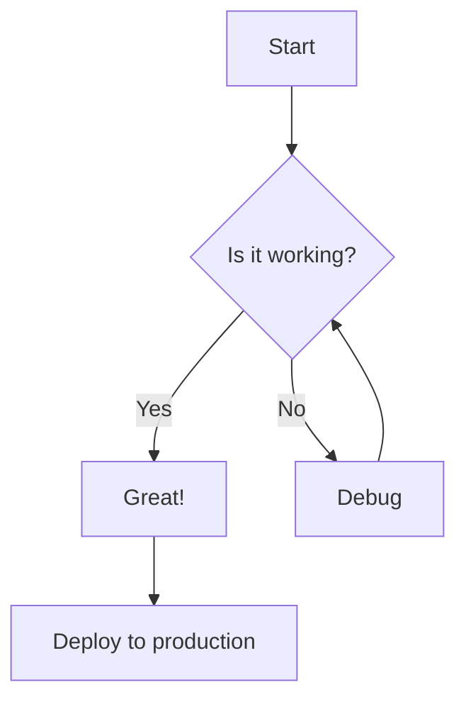
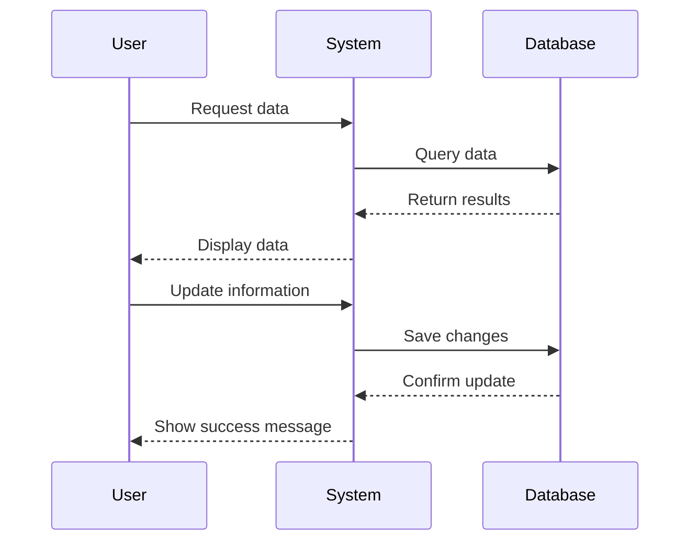
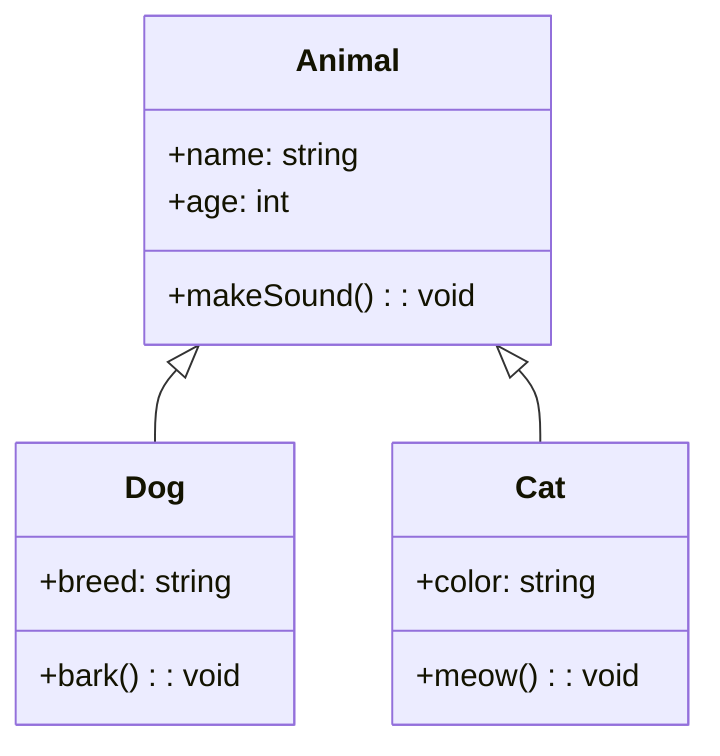
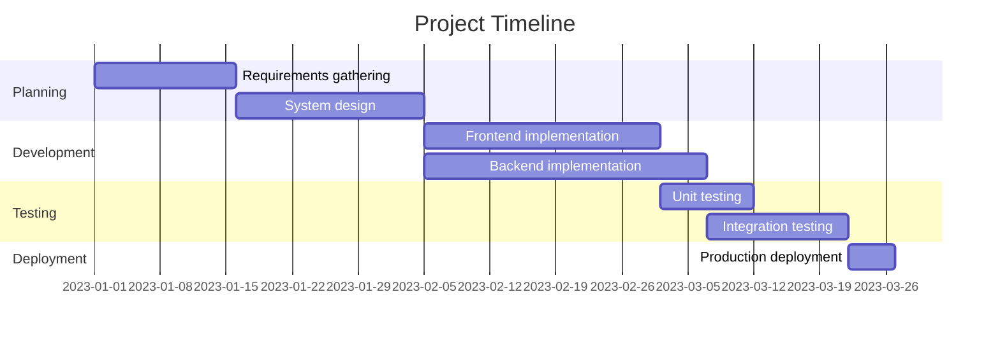
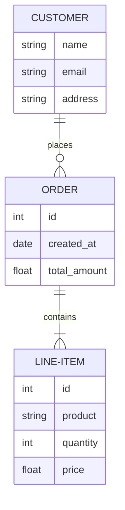
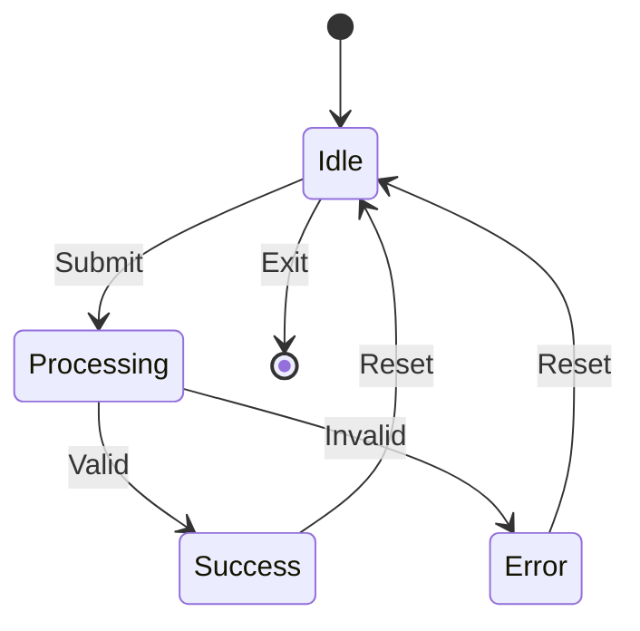

# Stress Test

This document is designed to test various features and capabilities of Docsify v5.

## Table of Contents

- [Mermaid Diagrams](#mermaid-diagrams)
- [Image Galleries](#image-galleries)
- [Code Blocks](#code-blocks)
- [Tables](#tables)
- [Text Formatting](#text-formatting)
- [Embeds and Media](#embeds-and-media)
- [Mathematical Formulas](#mathematical-formulas)

## Mermaid Diagrams

### Flowchart



### Sequence Diagram



### Class Diagram



### Gantt Chart



### Entity Relationship Diagram



### State Diagram



## Image Galleries

### Basic Image


### Image Grid

<!-- Using the image grid plugin -->

* 
* 
* 
* 

### Image with Caption


## Code Blocks

### JavaScript

```javascript
function calculateFactorial(n) {
    if (n === 0 || n === 1) {
        return 1;
    }
    return n * calculateFactorial(n - 1);
}

const result = calculateFactorial(5);
console.log(`The factorial of 5 is ${result}`);

// Example of async/await
async function fetchUserData() {
    try {
        const response = await fetch('https://api.example.com/users');
        const data = await response.json();
        return data;
    } catch (error) {
        console.error('Failed to fetch user data:', error);
    }
}
```

### Python

```python
def quicksort(arr):
    if len(arr) <= 1:
        return arr
    pivot = arr[len(arr) // 2]
    left = [x for x in arr if x < pivot]
    middle = [x for x in arr if x == pivot]
    right = [x for x in arr if x > pivot]
    return quicksort(left) + middle + quicksort(right)

# Example usage
unsorted_list = [3, 6, 8, 10, 1, 2, 1]
sorted_list = quicksort(unsorted_list)
print(f"Sorted list: {sorted_list}")

# Class example
class Person:
    def __init__(self, name, age):
        self.name = name
        self.age = age
        
    def greet(self):
        return f"Hello, my name is {self.name} and I am {self.age} years old."
```

### HTML/CSS

```html
<!DOCTYPE html>
<html lang="en">
<head>
    <meta charset="UTF-8">
    <meta name="viewport" content="width=device-width, initial-scale=1.0">
    <title>Sample Page</title>
    <style>
        body {
            font-family: Arial, sans-serif;
            line-height: 1.6;
            max-width: 800px;
            margin: 0 auto;
            padding: 20px;
        }
        .container {
            display: grid;
            grid-template-columns: repeat(auto-fill, minmax(200px, 1fr));
            gap: 20px;
        }
        .card {
            border: 1px solid #ddd;
            border-radius: 8px;
            padding: 15px;
            transition: transform 0.3s ease;
        }
        .card:hover {
            transform: translateY(-5px);
            box-shadow: 0 10px 20px rgba(0,0,0,0.1);
        }
    </style>
</head>
<body>
    <header>
        <h1>Welcome to My Page</h1>
    </header>
    <main>
        <div class="container">
            <div class="card">
                <h2>Card 1</h2>
                <p>This is some sample content.</p>
            </div>
            <div class="card">
                <h2>Card 2</h2>
                <p>More interesting information here.</p>
            </div>
        </div>
    </main>
</body>
</html>
```

## Tables

### Simple Table

| Name     | Age | Occupation       |
|----------|-----|------------------|
| John Doe | 32  | Software Engineer|
| Jane Smith| 28 | Data Scientist   |
| Bob Johnson| 45| Project Manager  |
| Alice Brown| 37| UX Designer      |

### Complex Table

| Project | Status | Progress | Deadline | Team Members | Budget ($) |
|---------|--------|----------|----------|--------------|------------|
| Website Redesign | In Progress | 65% | 2023-06-30 | John, Alice, Bob | 15,000 |
| Mobile App | Planning | 10% | 2023-09-15 | Jane, Mark, Lisa | 25,000 |
| Database Migration | Completed | 100% | 2023-01-10 | Bob, Charlie, Diana | 8,500 |
| API Integration | On Hold | 35% | 2023-08-01 | Alice, Jane, Robert | 12,000 |
| Security Audit | Not Started | 0% | 2023-07-20 | Charlie, Eve, Frank | 5,000 |

## Text Formatting

### Typography

# Heading 1
## Heading 2
### Heading 3
#### Heading 4
##### Heading 5
###### Heading 6

Regular text paragraph with **bold text**, *italic text*, and ~~strikethrough~~.

> This is a blockquote. It can contain multiple lines and even other formatting like **bold** or *italic*.
> 
> It can also have multiple paragraphs if needed.

### Lists

#### Ordered List

1. First item
2. Second item
   1. Nested item 1
   2. Nested item 2
3. Third item
4. Fourth item

#### Unordered List

- Item A
- Item B
  - Nested item X
  - Nested item Y
    - Even deeper item
- Item C
- Item D

#### Task List

- [x] Complete project setup
- [x] Create basic structure
- [ ] Implement core features
- [ ] Write tests
- [ ] Deploy to production

### Horizontal Rule

---

## Embeds and Media

### Video Player

[video](https://sample-videos.com/video321/mp4/720/big_buck_bunny_720p_30mb.mp4)

### YouTube Embed

[](https://www.youtube.com/watch?v=dQw4w9WgXcQ)

### PDF Embed

[Sample PDF Document](https://www.w3.org/WAI/ER/tests/xhtml/testfiles/resources/pdf/dummy.pdf)

## Mathematical Formulas

When $a \ne 0$, there are two solutions to $ax^2 + bx + c = 0$ and they are:
$x = {-b \pm \sqrt{b^2-4ac} \over 2a}$

$$
\begin{aligned}
\nabla \times \vec{\mathbf{B}} -\, \frac1c\, \frac{\partial\vec{\mathbf{E}}}{\partial t} & = \frac{4\pi}{c}\vec{\mathbf{j}} \\
\nabla \cdot \vec{\mathbf{E}} & = 4 \pi \rho \\
\nabla \times \vec{\mathbf{E}}\, +\, \frac1c\, \frac{\partial\vec{\mathbf{B}}}{\partial t} & = \vec{\mathbf{0}} \\
\nabla \cdot \vec{\mathbf{B}} & = 0
\end{aligned}
$$

## Custom Components

<div style="background-color: #f8f8f8; padding: 20px; border-radius: 8px; border-left: 4px solid #42b983;">
  <h3 style="margin-top: 0;">Tip</h3>
  <p>This is a custom-styled tip component using inline HTML and CSS.</p>
</div>

<div style="background-color: #fff3f3; padding: 20px; border-radius: 8px; border-left: 4px solid #ff5252;">
  <h3 style="margin-top: 0;">Warning</h3>
  <p>This is a custom-styled warning component using inline HTML and CSS.</p>
</div>

## Accordion Example

<details>
  <summary>Click to expand this section</summary>
  
  This content is hidden by default but can be expanded by clicking on the header.
  
  It can contain any markdown elements:
  
  - Lists
  - **Bold text**
  - *Italic text*
  
  ```javascript
  // Even code blocks
  function hello() {
    console.log("Hello from the hidden section!");
  }
  ```
</details>

<details>
  <summary>Another expandable section</summary>
  
  More hidden content in this second accordion section.
  
  
</details>
